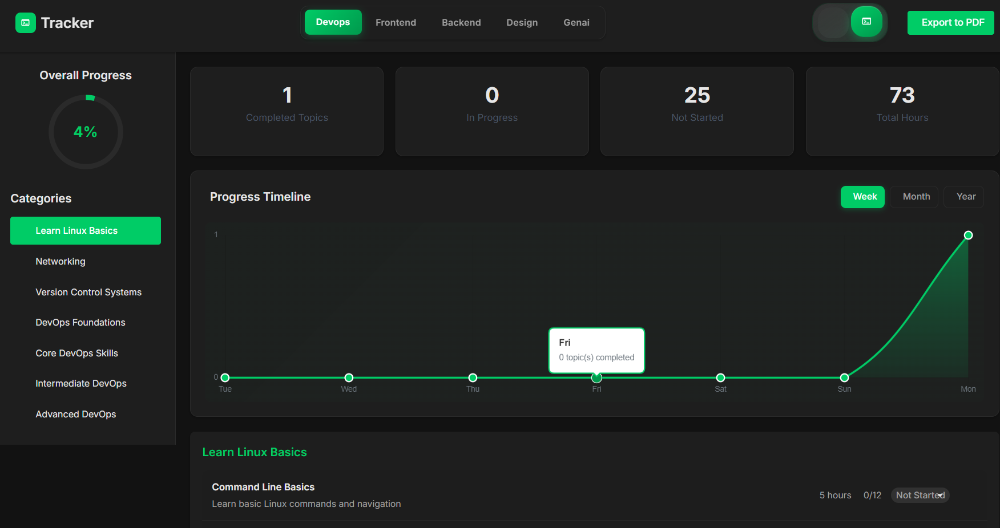

# Tracker📈

A progress-tracking roadmap to help users track their learning in 🌐 **Frontend**, ⚙️ **Backend**, ☁️ **DevOps**, 🎨 **Design**, and 🤖 **Generative AI (GenAI)**. Stay on track and monitor your progress interactively!

## 🚀 Tech Stack

- ⚛️ **React**: Build user interfaces.
- ⚡ **Vite**: Fast builds and hot module replacement (HMR).

## ✨ Advantages

- 🗺️ **Comprehensive Roadmaps**: Covers multiple domains.
- ✅ **Progress Tracking**: Monitor your learning journey.
- 🔧 **Minimal Configuration**: Pre-configured for ease of use.
- 📈 **Scalability**: Extendable with TypeScript and other tools.
- 🚀 **Performance**: Optimized for production.

## 🤝 How to Contribute

1. 🍴 **Fork** the repository.
2. 📥 **Clone** it: `git clone <your-fork-url>`.
3. 🌿 **Create a Branch**: `git checkout -b <branch-name>`.
4. ✍️ **Make Changes** and commit: `git commit -m "Your message"`.
5. 🔼 **Push Changes**: `git push origin <branch-name>`.
6. 🔁 **Create a Pull Request**.

---

Made with 💖 by Maitrek Patel.